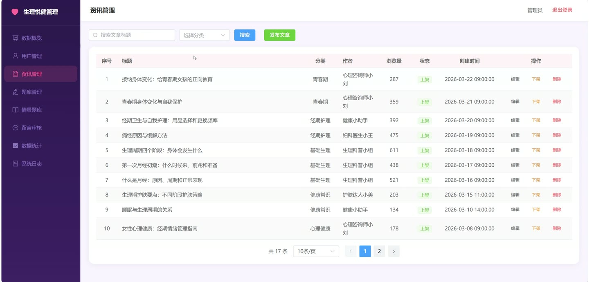
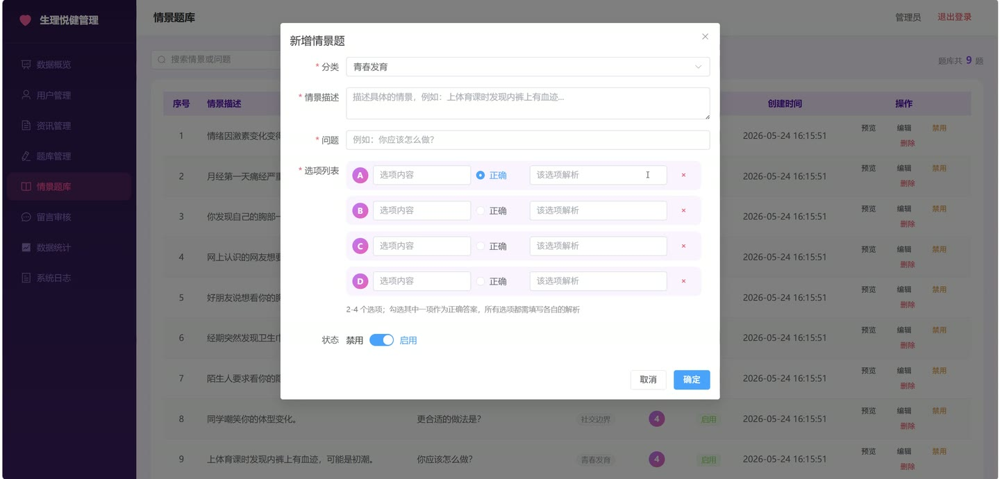
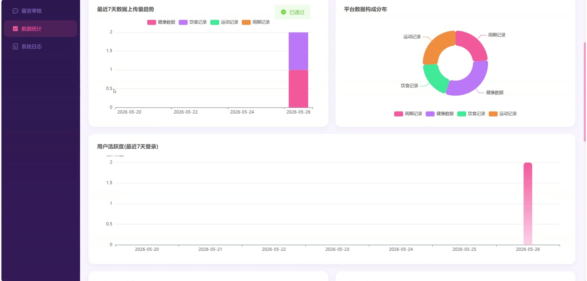
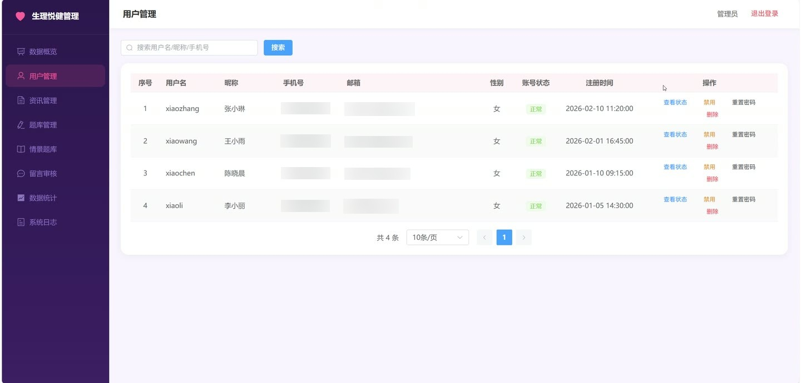

# (附文档)Springboot3+Vue3+MySQL “生理悦健” 女性生理健康管理平台

**技术栈**：Springboot3、Vue3、MySQL

### 系统简介

“生理悦健”女性生理健康管理平台，采用前后端分离架构，面向普通用户与管理员双角色。用户可记录生理周期、健康数据、饮食与运动，获取个性化分析与科普知识；管理员负责内容审核、用户数据总览与平台运营统计。
 
### 核心功能
 
### 普通用户端

 
- 生理周期记录：新增/编辑/删除经期记录，填写开始日期、结束日期、流量等级、情绪、症状（支持多选）与经期长度；系统自动计算周期长度并更新。 
- 周期列表与分页：按日期倒序展示所有周期记录，支持分页浏览。 
- 最近一次周期查询：获取最新一条周期记录，用于首页预测展示。 
- 健康数据记录：每日记录体重、基础体温、睡眠时长、身体症状（多选），支持新增、编辑、删除与分页查询。 
- 健康数据按日期范围查询：输入起止日期，获取该时间段内的所有健康记录，用于图表分析。 
- 周期预测：基于最近6次周期的加权平均算法，预测下次经期日期、排卵日及排卵窗口期；同时返回历史经期/排卵期范围用于日历标注。 
- 综合健康分析结论：自动生成周期规律性（标准差判断）、基础体温双相曲线分析、体重稳定性、睡眠质量、症状时间分布（经期/非经期）等标签与详细说明。 
- 饮食记录管理：按日期记录每餐类型（早/中/晚/加餐）、食物名称、热量与备注；支持按日期查询、分页、新增、编辑、删除。 
- 饮食建议查看：浏览所有公开饮食建议，或按生理阶段（如经期、卵泡期）筛选对应建议。 
- 运动记录管理：记录运动类型、时长、强度、消耗热量与日期；支持按日期范围查询、分页、新增、编辑、删除。 
- 运动建议查看：浏览所有公开运动建议，或按生理阶段筛选对应建议。 
- 科普文章浏览：分页查看已上架文章，支持按分类与关键词搜索；文章详情页自动增加浏览量。 
- 热门文章推荐：按浏览量排序展示前6篇热门文章。 
- 按分类查看文章：点击分类（如经期护理、青春期）直接筛选该分类下的文章。 
- 经期护理智能推荐：根据用户近30天健康数据中是否记录过痛经/腹痛/腰酸症状，自动匹配相关文章标题并推荐。 
- 文章评论：登录用户可对文章发表评论（需审核），支持树形结构展示评论列表与总条数；用户可删除自己的评论。 
- 生理知识测验：随机抽取5道选择题（可自定义数量），提交后记录分数、等级（萌新/学士/专家/大师）与错题ID列表。 
- 测验历史与详情：查看最近50次测验记录，点击单条记录可查看错题回顾（含错题ID列表）。 
- 青春情景测试：随机抽取3道情景题（可自定义数量），题目包含场景描述与选项。 
- 青春期留言板：登录用户可发布留言（支持匿名/实名），管理员审核通过后前台展示；用户可对已审核留言点赞。 
- 文件上传：上传图片/视频文件，返回可访问的相对URL路径。
 
### 管理员端

 
- 用户健康状态总览：查看指定用户的基本信息、生理周期摘要（总记录数、最近经期起止、流量、情绪、平均周期长度、规律性、当前所处阶段、预计下次经期）、健康数据统计（总记录数、最近记录日期、体重、体温、睡眠、身体状态、30天活跃度）。 
- 科普文章管理：分页查询所有文章（支持分类/关键词筛选），新增、编辑、删除文章，修改文章状态（上架/下架）。 
- 文章评论管理：管理员可删除任意评论。 
- 题库管理（生理知识测验）：分页查询题目（支持分类/关键词/状态筛选），新增、编辑、删除题目，批量导入题目（含自动校验ABCD选项）。 
- 题库管理（青春情景测试）：分页查询情景题（支持分类/关键词/状态筛选），新增、编辑、删除题目，批量导入情景题。 
- 青春期留言审核：分页查看所有留言（按状态筛选），审核通过/拒绝留言，删除留言。 
- 平台概览统计：查看用户总数、生理周期记录数、健康数据数、文章数、测验记录数、留言数、饮食记录数、运动记录数、今日活跃用户数、本月新增用户数。 
- 7天数据趋势：按日期展示最近7天健康数据、饮食记录、运动记录、周期记录的数量变化。 
- 科普数据统计：查看文章浏览量排行TOP10、分类阅读量分布、30天测验平均分趋势、各题目错误率排行（含错题率）、每日科普阅读与测验参与用户数。
 
### 技术栈

 后端框架Spring Boot 3 ORMMyBatis-Plus 权限控制自定义注解 + 请求属性拦截（角色校验 ADMIN/USER） 前端框架Vue 3 状态管理Pinia 构建工具Vite 数据库MySQL 前端路由Vue Router HTTP 客户端Axios
 
### 交付内容

 
- 后端完整源码 
- 前端完整源码 
- 数据库初始化脚本 
- 万字文档

## 界面展示

---

## 获取完整源码 + 万字文档

本仓库为项目介绍页。**完整前后端源码、数据库初始化脚本、万字项目文档**，请加微信 `kangkangcode`，或访问 [codekk.top](http://codekk.top) 获取。

可作课程设计 / 毕业设计参考，支持远程部署调试。